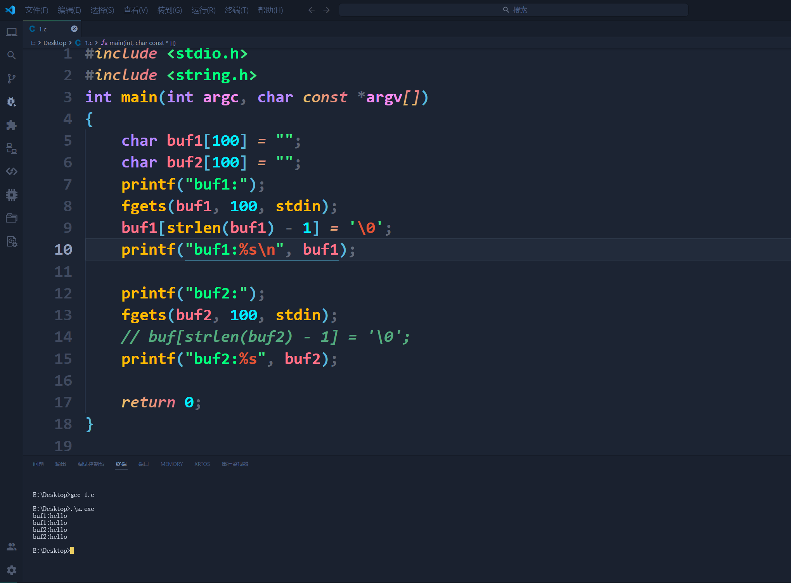

# C语言内存
系统最小分配单位是**字节**

最小存储单位**二进制**

[https://www.jianshu.com/p/e4309449ed20](https://www.jianshu.com/p/e4309449ed20)

堆区 栈区 全局区 文字常量区 代码区

在32位系统中，系统会为每个进程分配4GB的空间（虚拟）。

## 堆区（可读可写）
只能通过 **`malloc`** **`calloc`** **`realloc`  `free` **操作

## 栈区（可读可写）
可用 **`&`**  操作

局部变量，函数的形参，返回值>4字节

## 全局区（可读可写）
可用 **`&`**  操作

全局变量，局部变量，静态全局变量

## 文字常量区（只读）
常量，字符常量，字符串常量

## 代码区（只读）
代码的二进指令

## 普通局部变量
- 定义形式：在 **`{ }`**里面定义的变量为普通局部变量

- 作用范围：在  **`{ }`**内有效

-  生命周期：**`{ }`** 复合语句结束  局部变量被释放


- 内存区域：栈区


注意事项：

> 1，局部变量 不初始化 内容不确定
>
> 2，如果局部变量和全局变量同名，就近原则
>

```c
int</font>a</font>=</font>20;
{
	int</font>a</font>=</font>10;
	printf("1</font></font></font>%d\n",a);
	}
printf("2</font></font></font>%d\n",a);
```


## 普通全局变量
- 定义形式：在函数外定义的变量（不在**`{ }`** 内的）

- 作用范围：当前源文件 以及其他源文件都有效

- 生命周期：整个进程（运行的程序结束后才释放）

- 内存区域：全局区


注意事项：

> 1，全局变量不初始化 内容为0
>
> 2，如果 其他源文件 要使用全局变量 必须在使用处 **`extend`** 声明，并且同时编译 **`gcc`** 两个文件


## 静态局部变量
- 定义形式：在 **`{ }`**  定义，加  **`static`**修饰

- 作用范围：{ } 里有效


```c
static int a = 20;
printf("%d",a); //Print 20
```


- 生命周期：整个进程（运行的程序结束 后才释放）

- 内存区域：全局区


注意事项：

> 1，静态局部变量 不初始化内容为0
>
> 2，静态局部变量 只会定义一次
>

```c
void fn(void)
{
    int n = 10;

    printf("n=%d\n", n);
    n++;
    printf("n++=%d\n", n);
}

void fn_static(void)
{
    static int n = 10;

    printf("static n=%d\n", n);
    n++;
    printf("n++=%d\n", n);
}

int main(void)
{
    fn();
    printf("--------------------\n");
    fn_static();
    printf("--------------------\n");
    fn();
    printf("--------------------\n");
    fn_static();

    return 0;
}
```


## 静态全局变量
- 定义形式：全局变量前加 **`static`**修饰

- 作用范围：只能在当前源文件使用

- 生命周期：整个进程（运行程序结束后 才释放）

- 内存区域：全局区


注意事项：

> 1，不初始化为0
>
> 2，只在当前源文件有效
>

## 全局函数
定义的函数默认为全局函数

只要在其他文件加 **`extern`**申明，就可以在其他源文件使用

## 静态函数
普通函数前加 **`static`**

静态函数不能被其他源文件使用，防止同命名

## `const` 修饰变量为只读
```cpp
int main(){
	const int a=10;
	a = 100;
} 
```


### 可以通过修改空间内容进行修改值
```c
int main(){
    const int a=10;
    int *p;
    p = (int*)&a; // 强制类型转换 为int *类型
    *p = 100; //对p空间的内容的赋值为100
    printf("%d \n",a);
}
```


+ ~~C-Free output 10？~~

# GCC 工作流程
GCC编译器对程序的编译分为四个阶段 **预处理（预编译）、编译和优化、汇编和链接**

1. **预处理**: 在这个阶段主要做了三件事: **展开头文件** 、**宏替换** 、**去掉注释行**   这个阶段需要GCC调用预处理器来完成, 最终得到的还是源文件, 文本格式
2. **编译**: 这个阶段需要GCC调用编译器对文件进行编译, 最终得到一个汇编文件
3. **汇编**: 这个阶段需要GCC调用汇编器对文件进行汇编, 最终得到一个二进制文件
4. **链接**: 这个阶段需要GCC调用链接器对程序需要调用的库进行链接, 最终得到一个可执行的二进制文件


| **文件名后缀** | **说明** | **gcc参数** |
| --- | --- | --- |
| .c | 源文件 | |
| .i | 预处理后的c文件 | -E |
| .s | 编译之后得到的汇编语言的源文件 | -S |
| .o | 汇编后得到的二进制文件 | -c |


### 案例1 使用 `gcc -E` 命令
```c
#include <stdio.h> //头文件包含
#define Q 
#ifdef Q
int main(int argc, char const *argv[])
{
    printf("Hello!!!");
    return 0;
}
#endif 

#ifdef W
int main(int argc, char const *argv[])
{
    printf("World!!!");
    return 0;
}
#endif
```

```shell
gcc -E gcc.c -o gcc.i
```


生成的 **`gcc.i`** 文件与 **`gcc.c`** **文件对比，可以看到将源文件的头文件全部展开，宏替换和注释行删除。最后文件分为**头文件展开部分**加上**代码的有效部分。

### 案例2 使用 `gcc -S` 命令
```c
#include <stdio.h> //头文件包含
#define Q 
#ifdef Q
int main(int argc, char const *argv[])
{
    printf("Hello!!!");
    return 0;
}
#endif 

#ifdef W
int main(int argc, char const *argv[])
{
    printf("World!!!");
    return 0;
}
#endif
```

```shell
gcc -S gcc.c -o gcc.s
```


# 数据类型
## 浮点型常量
在计算机的世界中，浮点数的表示范围有限。使用二进制科学计数法，都包含三个部分：符号位、指数位和尾数部分。

### `Float` 单精度
单精度（float）在计算机中存储占用4字节，32位，有效位数为7位（6位小数+小数点）。


### `Double` 双精度
双精度（double）在计算机中存储占用8字节，64位，有效位数为16位（15位小数+小数点）。


### 代码
```c
#include<stdio.h>
int main(){
    float a;
    double b;
    a = 1.123456789;
    b = 1.123456789;
    printf("Float:%20.9f\n",a);//10表示显示20位子，不足部分用空格表示
    printf("Double:%20.9f\n",b);//。9表示小数位显示9位
    return 0;
} 
```


从运行结果可以看出，单精度浮点数`Float` 小数部分只有前6位是准确的，后三位是不准确的。双精度浮点数 `Double`小数部分9位都是准确的。

## C 语言字符串
在 C 语言中，字符串实际上是使用空字符**`\0`** 结尾的一维字符数组。因此，
**`\0`** 是用于标记字符串的结束。

**空字符（Null character**）又称结束符，缩写 **`NULL`**，是一个数值为**`0`** 的控制字符，**`\0`** 是转义字符，意思是告诉编译器，这不是字符 **`0`**，而是空字符


```c
#include <stdio.h>
 
int main ()
{
   char site[7] = {'R', 'U', 'N', 'O', 'O', 'B', '\0'};// 字符串自动在末尾加上 '\0' 标志

   printf("菜鸟教程: %s\n", site );
 
   return 0;
}
```


```c
#include <stdio.h>
 
int main ()
{
   char site[6] = {'R', 'U', 'N', 'O', 'O', 'B', '\0'};
 
   printf("菜鸟教程: %s\n", site );
 
   return 0;
}
```


# 输入输出函数
**义字符**

| \n | 换行 | |
| --- | --- | --- |
| \t | 水平制表 | |
| \v | 垂直制表 | |
| \\ | 表示一个\ | |
| %% | 表示一个% | |
| \abc | 八进制数，三个数字，数字范围 0~7 | |
| **\x** h... | 十六进制数字，数字个数无要求，数字范围0~F，前缀必须/x | |


**标准文件**

| 标准文件 | 文件指针 | 设备 |
| --- | --- | --- |
| 标准输入 | stdin | 键盘 |
| 标准输出 | stdout | 屏幕 |
| 标准错误 | stderr | 屏幕 |


## `fgets()`函数
C 库函数 **`char *fgets(char *str, int n, FILE *stream)`** 从指定的流 stream 读取一行，并把它存储在 **`str`** 所指向的字符串内。当读取 **`(n-1)`** 个字符时，或者读取到换行符时，或者到达文件末尾时，它会停止，具体视情况而定。

```c
char *fgets(char *str, int n, FILE *stream)
```

- **`str`**-- 这是指向一个字符数组的指针，该数组存储了要读取的字符串。
- **`n`**-- 这是要读取的最大字符数（包括最后的空字符`\0`）。通常是使用以 str 传递的数组长度。
- **`stream`** -- 这是指向 FILE 对象的指针，该 FILE 对象标识了要从中读取字符的流。
- 默认**`stdin`**，标准输入设备

```c
#include<stdio.h>
 
int main(){
	char s[6];
	fgets(s,6,stdin); //在终端输出5个字符串和一个\0
    //输入"Hello World"输出"Hello"
	printf("%s",s);
}
```

**`fgets`** 函数能获取带空格  ` ` 的字符串，同时会获取 **`\n`** 回车符

##  `getchar()` & `putchar()` 函数
**`int getchar(void)`** 函数从屏幕读取下一个可用的字符，并把它返回为一个整数。这个函数在同一个时间内只会读取一个单一的字符。可以在循环内使用这个方法，以便从屏幕上读取多个字符。

**`int putchar(int c)`** 函数把字符输出到屏幕上，并返回相同的字符。这个函数在同一个时间内只会输出一个单一的字符。可以在循环内使用这个方法，以便在屏幕上输出多个字符。

```c
#include<stdio.h>

int main (){
	int a;
	printf("String:");
	for(int i = 0 ; i<= 2 ;i ++){
	a = getchar();
	putchar(a);
	printf("\n");
	}
}
```


```c
#include<stdio.h>

int main (){
	int a;
	printf("String:");	
	a = getchar();//getchar函数只能读取第一个字符，a = 第一个字符串
	for(int i = 0 ; i<= 2 ;i ++){
	putchar(a);
	printf("\n");
	}
}
```


## 4.3. `gets()` & `puts()` 函数

```c
char s[];//数组a
get(s);//get函数专门针对字符串数组输入
```

**`char *gets(char *s)`** 函数从 **`stdin`** 读取一行到 **`s`** 所指向的缓冲区，直到一个终止符或 EOF（End of File）。**`gets`**会识别换行符 **`\n`**, 并且以字符**`\0`** 为一个字符串的输入结束标志，**`gets`**获取一个字符串之后识别字符串后面的换行符**`\n`**，并将其丢弃，不会留在缓冲区。

获取字符串的时候不会判断存储空间是否越界，很容易访问非法内存。

**`int puts(const char *s)`** 函数把字符串和一个尾随的换行符写入到屏幕。

（只能读取字符串 **`char`** 类型，不能输出数值或进行格式变换，同时它支持直接输出字符串在终端。 **`puts`** 输出自动换行 **`\n`**）。

```c
#include <stdio.h>
#include <string.h>
int main(int argc, char const *argv[])
{
    char buf1[100] = "";
    char buf2[100] = "";
    printf("buf1:");
    fgets(buf1, 100, stdin);
    buf1[strlen(buf1) - 1] = '\0';
    printf("buf1:%s\n", buf1);

    printf("buf2:");
    fgets(buf2, 100, stdin);
    // buf[strlen(buf2) - 1] = '\0';
    printf("buf2:%s", buf2);

    return 0;
}
```



```c
#include<stdio.h>

int main (){
	char s[100];
	gets(s);
	puts(s);
	
}
```

## `scanf` 和 `printf` 函数
**格式化输出字符**

| 字符  | 说明                                                         |
| ----- | ------------------------------------------------------------ |
| %d    | 十进制有符号数字                                             |
| %u    | 十进制无符号数                                               |
| %x    | 十六进制无符号整数                                           |
| %o    | 八进制无符号数                                               |
| %f    | float 型浮点数                                               |
| %lf   | double型浮点数                                               |
| %e    | 指数型浮点数                                                 |
| %c    | 单个字符                                                     |
| %p    | 打印地址，以十六位显示全部地址                               |
| %-7d  | 输出的时候是左对齐，最少输出7位，不足7位的右端补空格         |
| %m.nf | 1 m:总宽度,包括小数点   2 n:小数部分位数   3 m>n+1, 也可以小于, 但编译结果会按实际数据输出   4 如果m过大, 会在左边补空格 |

**`int scanf(const char *format, ...)`**函数从标准输入流 stdin 读取输入，并根据提供的 format 来浏览输入。

需要注意的是，前面讲“清空缓冲区”的时候讲过，用 **`scanf`** 输入时，不管输入什么，最后“敲”的回车都会被留在缓冲区，这里也不例外。输入字符串时最后“敲”的回车也会被留在缓冲区，如果紧接着要给一个字符变量赋值的话，那么还没等你输入系统就自动退出来了。因为系统自动将回车产生的字符 **`\n` **赋给该字符变量了，所以此时对字符变量赋值前要首先清空缓冲区。

**`%s`** 获取字符串遇到 **`空格` `回车`**自动结束

**`int printf(const char *format, ...)`** 函数把输出写入到标准输出流 stdout ，并根据提供的格式产生输出。

**format** 可以是一个简单的常量字符串，但是您可以分别指定 **`%s`、`%d`、`%c`、`%f`** 等来输出或读取字符串、整数、字符或浮点数。还有许多其他可用的格式选项，可以根据需要使用。

**`printf`** 识别到 **`\0`** 退出函数

```c
printf("he\0kko");// Print he
printf("hekko"); //Print hekko
```


```c
scanf("%d",&a);
getchar();//提取缓冲区的回车
```

# 位操作

| 符号 | 意义 | 说明                                                         |
| :--- | ---- | ------------------------------------------------------------ |
| &    | 与   | 两个位都为1时，结果才为1                                     |
| \|   | 或   | 两个位都为0时，结果才为0                                     |
| ^    | 异或 | 两个位相同为0，相异为1                                       |
| ~    | 取反 | 0变1，1变0                                                   |
| <<   | 左移 | 各二进位全部左移若干位，高位丢弃，低位补0                    |
| >>   | 右移 | 各二进位全部右移若干位，对无符号数，高位补0，有符号数，各编译器处理方法不一样，有的补符号位（算术右移），有的补0（逻辑右移） |


```c
data = data & ~(0x01 << 0 | 0x01 << 1 | 0x01 << 3 | 0x01 << 7);
//将data第零位，第一位，第三位，第七位 赋值0
```

```c
data = data | (0x01 <<4 | 0x01 << 6);
//将data第四位，第六位 赋值1
```

# 数组
## 数组的定义
```c
type arrayName [ arraySize ];
```

> **`type` **类型，可以是任意有效的 C 数据类型
>
> **`arrayName` **数组名
>
> **`arraySize` **数组大小，必须是大于零的整数常量

**`type` **类型，可以是任意有效的 C 数据类型

**`arrayName` **数组名

**`arraySize` **数组大小，必须是大于零的整数常量

大括号 { } 之间的值的数目不能大于我们在数组声明时在方括号 [ ] 中指定的元素数目。

数组是从0开始，`array[10]`是第十一位数字。

数组名都是符号常量，不能被单独赋值。

## 获取数组长度
```c
int numbers[] = {1, 2, 3, 4, 5};
int length = sizeof(numbers) / sizeof(numbers[0]);// sizeof(numbers)数组总大小
```


`sizeof(array[0][0])` 为一个元素占用的空间;

`sizeof(array[0]) `为一行元素占用的空间;

`sizeof(array)` 为整个数组占用的空间;

```c
二维数组行数 = sizeof(array)/sizeof(array[0]);
二维数组列数 = sizeof(array[0])/sizeof(array[0][0]);
```

数组名作为类型代表的是数组的总大小

## 一维数组操作


```c
double balance[10];// 逐个初始化数组
double balance[5] = {1000.0, 2.0, 3.4, 7.0, 50.0};
double balance[] = {1000.0, 2.0, 3.4, 7.0, 50.0};//如果省略掉了数组的大小，数组的大小则为初始化时元素的个数。
balance[4] = 50.0;
```


```c
int arr[5] = {1,2,3};
//部分初始：化未被赋值部分为0 {1,2,3,0,0}
int arr[5] = {[1]=10,[3]=30};
//指定下标初始化：第一个初始化为10，第三个初始化为30 {0，10，0，30，0}
```


```c
char buf1[]={'h','e','l','l','o'};
char buf2[]={"hello"};//自动添加'\0'（推荐，方便对字符串遍历）

printf("sizeof=%d",sizeof(buf1); //print 5
printf("sizeof=%d",sizeof(buf2); //print 6    
```


```c
char s1[128]="Hello World";// 字符串自动添加 '\0'
char s2[128]="Hello\0World";
char s3[128]="\0Hello World";
//printf函数输出s识别 '\0' 自动结束输出
//printf函数默认从s首地址开始遍历
printf("%s",&s[3]);//输出 "lo World"
printf ("\n");

printf("%s",s1);//输出"Hello World"
printf("\n");

printf("%s",s2);//输出"Hello"
printf("\n");

printf("%s",s3);//输出""
printf("\n");
```

字符数组可以通过 `While` `For` 等循环语句遍历


```c
char s1[128] ;
char s2[128] ;
char s3[128] ;
//全部输入"Hello World"

//scanf() 函数输入
scanf("%s",&s1);

//gets() 函数输入
gets("%s",&s2);

//fgets() 函数输入
fgets(s3,sizeof(s3)/sizeof(s3[0]),stdin);

printf("%s\n",s1);//Print "Hello"
printf("%s\n",s2);//Print " World"
printf("%s\n",s3);//Print "Hello World"
```


输入 **"`Hello World`"**

 **`scanf`** 函数识别到 ` ` 后结束输入，清空缓冲区后将 ` ` 存储在缓冲区。

**`gets`** 先读取缓冲区里面的 ` ` ，从输入中读取 **`World`** ，读取到回车键 **`\n`** 退出 **`gets`** 函数并且清空缓冲区。

**`fgets`** 读取并且显示终端。


删除 **`fgets`**函数获取的 **`\n`**

```c
char s[] = "";
//输入 "Hello"
fgets(s,sizeof(s),stdin);
s[strlen(s)-1] = 0
```


**`strlen(s) = 6`**

**`s[strlen(s)-1]`**读取 **`s[5]`**内容

**`s[strlen(s)-1] = 0`** 将 **`\n`** 赋值为 **`\0`**

## 二维数组
存放多个字符串


```c
char arr[4][128] = {""};//二维数组初始化
```

```c
int row = sizeof(arr)/sizeof(arr[0]);
int i = 0;
for(i;i<row;i++){
	scanf("%s",arr[i]);//scanf函数输入
	}
for(i=0;i<row;i++){
	printf("----%s\n",arr[i]);
	}
```


scanf（）函数输入以空格 **` **` 为分界

```c
int row = sizeof(arr)/sizeof(arr[0]);
int i = 0;
for(i;i<row;i++){
fgets(arr[i],sizeof(arr[0]),stdin);//fgets函数输入
		}
for(i=0;i<row;i++){
	printf("----%s\n",arr[i]);
		}
```


`fget()`函数输入以回车 **`\n`** 分界

# 函数
函数在传参的时候，会在函数内部开辟新的空间，并且拷贝传入参数的值，但当传入的是地址（指针变量）的是时候不会调用该空间

函数的形参在定义的时候不会开辟空间，只有在函数调用的时候才会给形参开辟空间

## 传值调用
**如果 普通变量 作为函数的 形参 函数内部无法修改外部实参的值**

```c
void chuanzhidiaoyong(int data){
	data = 100;
	return;//结束自定义函数，返回主函数
	}
int main(int argc,char *argv[])
{
	int data = 10;
	chuanzhidiaoyong(data);
	printf("%d\n",data);
}
```


## 一维数字数组作为函数的形参
为了避免在函数内部额外为数组开辟空间造成的巨大空间耗用，函数内部不会对传入的数组开辟新的空间

一维数值数组 作为函数的 形参 函数内部 可以通过形参 对外部数组的元素进行读写

传数组类型 传地址操作

```c
void print_int_array(int array[5],int n){
    array[2] = 1000;
    return;
int main(){
    int arr[5] = {10,20,30,40,50};
    int n = sizeof(arr)/sizeof(arr[0]);
    printf_int_array(arr,n);//将arr首地址传入自定义函数
    printf("数组arr[2]=%d",arr[2]);//Print arr[2] = 1000
}
```


# 指针
指针变量本质是 `变量`，存储 `地址编号`

- 在32位系统中 任何指针变量大小位`4字节`

- 在64位系统中 任何指针变量大小位`8字节`


```c
printf("%ld\n",sizeof(char *));
printf("%ld\n",sizeof(short *));
printf("%ld\n",sizeof(int *));
printf("%ld\n",sizeof(long *));
printf("%ld\n",sizeof(float *));	
printf("%ld\n",sizeof(double *));
printf("%ld\n",sizeof(char ***));
```


## 指针变量的定义
1， **`*`** 修饰指针变量名

2，保存谁的地址就定义谁

3，从上往下 整体 替换

```c
int *p; //指针p保存int data地址

int (*p)[5];//保存int arr[5]的首地址

int *p; //保存int arr[5]首元素地址

struct stu *p;//结构体 struct stu lucy的地址；

int (*p)[int,int];//函数指针


```

**`*p`**表示p指针代表的地址编号对应的内容

（取内容）

```c
int *p;
p = &data;

printf("%d  %d\n",data,*p);// Print 数据一样
```

## 指针定义
为了防止出现野指针，在变量声明的时候，如果没有确切的地址可以赋值，为指针变量赋一个**`NULL`** 值是一个良好的编程习惯。赋为 **`NULL`** 值的指针被称为**空**指针。

**在对指针类型应用解除引用运算符（\*）之前，将指针初始化为一个确定的，适当的地址，这是使用指针的金科玉律**

```c
int *p1;//p1 变量保存的地址所在内存单元中的数据类型为整型
//p1是局部指针变量 不初始化 指向不确定的空间，一旦操作，容易访问违法内存
int *p2=NULL;
```


```c
int data = 10;
int *p2 = &data;
//p2指向data &data赋值给p2 而不是*p2
```


```c
int data = 10 , *p3 = &data;
```


```c
int *p;
int *p1;
*p=a; // 指针p没有指向
printf("%d\n",*p);
```

## 指针变量的类型
 指针变量指向的类型：决定了指针变量的跨度、取值宽度

```c
int data = 0x12345678;
int *p1 = &data;
short *p2 = &data;
char *p3 = &data;
printf("p1=%x\np2=%x\np3=%x\n",*p1,*p2,*p3);//地址存储倒序
```


```c
int data = 1;
int *p1 = &data;
int *p2;
char *p3;
p2 = p1+1;
p3 = p1+5;
printf("p1=%p\np2=%p\np3=%p\n",p1,p2,p3);
//p1=0x7ffc60ad038c
//p2=0x7ffc60ad0390
//p3=0x7ffc60ad03a0
```


`p2 = p1 + sizeof(int)*1;`

`p3 = p1 +sizeof(char)*5;`

## 指针变量注意事项
1，**`void num`** 系统服务发根据 **`void`** 类型确定 **`num`** 的空间大小，所以无法定义；

**`void *p`   `p`**  的类型位 **`void *`** ，在32位平台 **`void *`** 为4字节，系统能为p开辟4字节空间大小，所以定义成功。

不能直接对 **`p`** 取 * ，**`*p`** 报错，不能通过 **`void`** 决定取值宽度，所以 *p 失败；

不能直接**`p+1`**  ，报错，不能通过 **`void`** 决定单位跨度，所以 **`*p`** 失败；

**`void *p`** 是万能指针，能保存任何一级地址。一般用于函数形参 让算法通用；

如果要用 **`p`** 取值或跳跃，必须实现对 **`p`** 进行强制类型转换。

2，不要对未初始化的指针变量取值

3，不要对初始化为 **`NULL`** 的指针变量取值

4，操作指针变量不要越界

5，数组名作为类型，代表数组的总大小 **`== sizoof(arr)`**

6，数组名代表地址，代表数组的首元素地址 **`arr == &arr[0]`**

7，指向同一数组的元素指针变量 相减 得到的差为元素相差的个数

8，指向同一数组的元素指针变量 相加 无意义


9，指向同一数组的元素指针变量 判断相等 判断是否指向同一个数组

10，指向同一数组的元素指针变量 判断大小 判断关系位置

11，指向同一数组的元素指针变量 赋值 **`p2=p1`**让p2和p1指向同一处

## 字符数组和字符指针变量的区别
```c
char *s1;
char s2[32];

//对s1赋值，可以直接等一，s1指向该字符串的首地址
s1 = "Hello World";

//对s2赋值，需要使用 strcpy 函数
strcpy(s2,"Hello World");

//遍历两个字符串
printf("%s\n%s\n",s1,s2);
```


二者操作单个字符的方式

```c
*(s1+2);
s2[2];
```


## 指针的指针


```c
int data = 10;
int *p = &data;
int **q = &p;
```

**`*q == p ==&data`**

**`**q == *p ==data`**

## 指针数组
**`int *p[10];` **

本质是数组

一个数组存放了 **`10`** 个**`int *`**类型的数据；或者说这个当 一个数组里含有的元素为指针类型的时候，它就被成为**指针数组**

用  **`char*`**  类型数组保存字符串

```c
#include <stdio.h>

int main(int argc, char const *argv[])
{
    char *str[32] = {"Haello", "World"};
    int size;
    printf("%s\n", str[0]);          // 输出str第0个字符串
    printf("%s\n", *str);            // 输出str第0个字符串
    printf("%s\n", str[1]);          // 输出str第1个字符串
    printf("%s\n", *(str + 1));      // 输出str第1个字符串
    printf("%c\n", str[1][2]);       // 输出str第1个字符串中第2个字符
    printf("%c\n", (*(str + 1))[2]); // 输出str第1个字符串中的第2个字符
    printf("%c\n", (*str + 1)[1]);   // * 先和str结合，选择str的第一个字符串，
    //str+1选择第一个字符，【2】往后移动两位 输出第0个字符串的 第3个字符
    return 0;
}
```


## 数组指针
本质是数组

数组指针，顾名思义，就是指向数组的指针。

数组指针变量：本质是指针变量 保存的是数组的 首地址

```c
int arr[5] = {10,20,30,40,50};
//&arr代表arr数组地址，&arr+1跳过这个数组
//arr代表首元素地址，arr+1跳入下一个元素地址
printf("arr = %lu\n", arr);
printf("arr+1 = %lu\n", arr+1);
printf("&arr = %lu\n", &arr);
printf("&arr+1 = %lu\n", &arr+1);
```

****

**`arr`** 和 **`&arr`**地址编号上是同一个地址编号，只是类型不同


### `*p` `int(* p)[n] = { }`数组指针定义
（）里是 **`*p`**，先定义了指针，所以 **`p`**  是个指针，然后后面是[ ],才是数组，即 **数组指针**。它指向了含有 **`n`** 个 **`int`** 类型的数组。

![如上图所示，假设定义 int (*p2)[5] = { 0, 0, 0, 0, 0}; 那么p2就指向了这个包含5个int类型的数组了p2在内存中指向的是这个数组的首地址，是和数组有关联的，而绝不仅仅是指向数组首元素的地址](https://cdn.nlark.com/yuque/0/2023/jpeg/40457975/1701073786561-4a9e3602-4185-4cb3-92e8-dd493c1860e3.jpeg)


```c
int arr[5] = {10,20,30,40,50};
int (*p)[5];
//p自身的类型为int(*)[5]
printf("%lu\n",sizeof(p));
//p指向的类型为 int[5]
printf("%lu\n",p);
printf("%lu\n",p+1);
```

![（*p）[5]没有赋值](https://cdn.nlark.com/yuque/0/2023/png/40457975/1701072898823-98d30cd7-ff2e-4a0a-af7d-b832f721a5d6.png)


```c
int arr[5] = {10,20,30,40,50};

int (*q)[5]=&arr;
// q 指针指向的数组arr的首地址，不是首元素的地址
// 两者地址编号相同，但是含义不同
printf("%lu\n",sizeof(q));
printf("%lu\n",q);
printf("%lu\n",q+1);
printf("%lu\n",*(*q+1));
return 0;
```


**`arr[n1]`** 和 **`(*p)[n2]`** n1和 n2必须 相等

## 二维数组


```c
int arr[3][4] = {{1,2,3,4},{5,6,7,8},{9,10,11,12}};
printf("%d\n",arr[1][2]);
printf("%d\n",*(*(arr+1)+2));
printf("%d\n",*(arr[1]+2));
```


> **`int (*p)[4] = arr` **这时候指针 **`p`** 和 **`arr`** 二维数组完全等价
>
> 一维数组指针 **`int (*p)[4]`** 和二维的数组名 **`int arr[3][4]`** 是等价
>
> 二维数组指针 **`int (*p)[4][5]`**  和三维的数组名 **`int arr[3][4][5]`** 是等价
>

## 指针变量传值调用
**自定义函数必须通过指针才能更改函数外部的数据的值**

使用传递地址操作可以通过自定义函数**修改 `main`** 函数内定义数字的数值

```c
void set_void(int *p){
    *p = 1000; 
}
```


## 【案例】 用数组选择最大和最小的数字
```c
#include <stdio.h>

void select_Nums(int *nums, int n, int *max, int *min)
    // 将 max 和 min 的地址传入自定义函数
{
    int p_max = nums[0]; //将第一数组的大小赋值给p_max
    int p_min = nums[0]; //将第一数组的大小赋值给p_min
    for (int i = 1; i < n; i++)
    {
        p_max = (p_max < nums[i] ? nums[i] : p_max);
        p_min = (p_min > nums[i] ? nums[i] : p_min);
    }
    *max = p_max; //将 p_max 数值传入max地址的内容
    *min = p_min; //将 p_min 数值传入min地址的内容
}
int main(int argc, char const *argv[])
{
    int nums[10];
    int n;
    for (int i = 0; i < 10; i++)
    {
        scanf("%d", &nums[i]);
    }
    n = sizeof(nums) / sizeof(nums[0]);
    for (int i = 0; i < 10; i++)
    {
        printf("%d  ", *(nums + i));
    }
    int max;//分配空间
    int min;
    select_Nums(nums, n, &max, &min);
    printf("\nMAX=%d\nMIN=%d\n", max, min);
}
```


## **指针作为函数的的返回值**
函数不要返回局部变量 **函数结束** 函数内部的局部变量和局部数据将被 **释放**

```c
#include<stdio.h>

int *get_address(void ){
    int data =200;
    return &data;
}

int main(int argc, char const *argv[])
{
    int *p;
    p = get_address();
    //函数调用结束，内存释放
    printf("%d",*p); //输出错误，内存释放，访问非法内存
    return 0;
}
```


加入 **`static`**

**`static` **静态局部变量


## 函数指针
| **`()` 优先级 > `*`** | 主体 | 返回类型 |
| --- | --- | --- |
| 指针函数 **`int *p(int x,int y);`** | 函数 | 返回值为指针类型 |
| 函数指针 **`int (*p)(int x,int y);`** | 指针 | **`(*p)`**是指针 指向一个函数 |


本质是一个**指针变量**  指向该地址保存的是 **函数入口地址**

**函数名** 代表的是函数的 **入口地址**

```c
printf("%p",printf);//Print 0x400400
```


 

**`int (*p)(int x, int  y);  == int (*p)(int, int);`**

参数名可以去掉，并且通常都是去掉的。这样指针p就可以保存函数类型为两个整型参数

返回值是整型的函数地址了。

```c
int add(int x,int y)
{
    return x+y;
}

int sub(int x,int y)
{
    return x-y;
}

int mul(int x,int y)
{
    return x*y;
}
int main(int argc, char const *argv[])
{
    int (*p)(int,int);//定义指针函数指针p 指针p指向函数地址
    //int (*p)(int x,int y);
    p = add; //代表函数add首地址传入给指针p
    printf("3 + 5 = %d\n",p(3,5));
    p = sub;
    printf("8 - 6 = %d\n",p(8,6));
    p = mul;
    printf("6 * 1 = %d\n",p(6,1));
}
```


# 动态内存申请
## 堆空间
需要使用 **`malloc` `calloc` `realloc`** 从堆空间申请空间，必须 使用 **指针变量** 取保存得到的地址编号

使用完后 调用 **`free`** 释放堆区空间

在 **`Ubuntu 16.04`** 中使用 **`gcc`** 编译器 **`malloc`**会对申请到的空间自动清零

**`calloc`**可以自动清零

队去空间是在程序需要 申请 所以又叫做 **`动态空间`**

## `malloc` 申请堆区空间
```c
#include<stdlib.h>
void *malooc(size_t size);
```

> **`size`**申请空间大小 （单位字节）

返回值 ：

> 成功：返回堆空间的起始地址
>
> 失败：返回 **`NULL`**
>


### **申请空间**
```c
int *p = (int *)malloc(sizeof(int));
```

### **判断空间**
```c
if(p1 == NULL){
 printf("malloc error");
    return ;
}
```

### **使用空间**
```c
*p1 = 1000;
printf("%d\n",*p);
```

### 释放空间
只能释放 **`堆区`**的空间

```c
free(p);
```

### 
### 申请动态数组

申请动态数组的基本流程：

1. **`int *arr;` **定义指针
2. **`arr =  (int *)malloc(sizeof(int)*n);`**为指针申请 **`n`** 个 **`sizeof(int)`**大小的内存
3. **`free`**释放空间

```c
#include <stdio.h>
#include <stdlib.h>

int main(int argc, char const *argv[])
{
    int *arr;//定义指针
    int n;
    printf("要输入的数字个数：");
    scanf("%d",&n);
    arr = (int *)malloc(sizeof(int)*n);//申请空间
    for (int i = 0; i < n; i++)
    {
        scanf("%d",arr+i);
    }
    getchar();
    for (int i = 0; i < n; i++)
    {
        printf("%d  ",*(arr+i));
    }
    printf("\n");
    free(arr); //释放空间
    return 0;
}

```


## calloc
任何平台下 **`calloc`**可以自动清零

**`void *calloc(size_t nitems, size_t size)`**

> **nitems** -- 要被分配的元素个数。
>
> **size** -- 元素的大小

该函数返回一个指针，指向已分配的内存。如果请求失败，则返回**`NULL`**

**`calloc`**申请的空间必定连续

```c
#include <stdio.h>
#include <stdlib.h>

int main(int argc, char const *argv[])
{
    int *arr;
    int n;
    printf("要输入的数字个数：");
    scanf("%d",&n);
    arr = (int *)calloc(n,sizeof(int));//申请 n 个 sizeof(int) 大小的空间
    for (int i = 0; i < n; i++)
    {
        scanf("%d",arr+i);
    }
    getchar();
    for (int i = 0; i < n; i++)
    {
        printf("%d  ",*(arr+i));
    }
    printf("\n");
    free(arr);
    return 0;
}
```

 

## `realloc` 追加空间
**`realloc`** 只能对 **`malloc`** 或 **`calloc`** 申请的堆区空间进行追加

**`void *realloc(void *ptr, size_t size)`**

> **ptr** -- 指针指向一个要重新分配内存的内存块，该内存块之前是通过调用 malloc、calloc 或 realloc 进行分配内存的。如果为空指针，则会分配一个新的内存块，且函数返回一个指向它的指针。
>
> **size** -- 内存块的新的大小，以字节为单位。如果大小为 0，且 ptr 指向一个已存在的内存块，则 ptr 所指向的内存块会被释放，并返回一个空指针

```c
int *arr;
arr = (int *)realloc(sizeof(int)*(5+5));
```

## `memset` 内存空间设置
**`void *memset(void *str, int c, size_t n)`**

复制字符 **`c`**（一个无符号字符）到参数 **`str`** 所指向的字符串的前 **`n`** 个字符

> **str** -- 指向要填充的内存块。
>
> **c** -- 要被设置的值。该值以 int 形式传递，但是函数在填充内存块时是使用该值的无符号字符形式。
>
> **n** -- 要被设置为该值的字符数。

注意：字符串操作时不会添加 **`\0`** 对字符串遍历时容易越界。

返回值：该值返回一个指向存储区 **`str`** 的指针。

```c
#include <stdio.h>
#include <string.h>
 
int main ()
{
   char str[50];
 
   strcpy(str,"This is string.h library function");
   puts(str);
 
   memset(str,'$',7);
   puts(str);
   
   return(0);
}
```


## `memcpy`内存拷贝
**`void *memcpy(void *str1, const void *str2, size_t n)`** 从存储区 **`str2`** 复制 **`n`** 个字节到存储区 **`str1`**。

> **str1** -- 指向用于存储复制内容的目标数组，类型强制转换为 void* 指针。
>
> **str2** -- 指向要复制的数据源，类型强制转换为 void* 指针。
>
> **n** -- 要被复制的字节数

返回值：该函数返回一个指向目标存储区 **`str1`** 的指针。

```c
#include <stdio.h>
#include <string.h>
#include "stdlib.h"

int main(int argc, char const *argv[])
{
    int arr1[5]={10,20,30,40,50};
    int *arr2;
    arr2 = (int*)malloc(sizeof(arr1));
    memcpy(arr2,arr1,sizeof(arr1));
    for (int i = 0; i < 5; i++)
    {
        printf("%d ",arr2[i]);
    }  
    return 0;
}
```


## 静态数组和动态数组
### 静态数组
**类似**`int arr[5]`**

在编译的时候就已经确定了数组的大小。

数据过多溢出，数据过小浪费空间

### 动态数组
从堆空间申请空间，在运行的时候根据用户的输入决定空间的大小。

```c
#include <stdio.h>
#include <string.h>
#include "stdlib.h"

int main(int argc, char const *argv[])
{
    int *arr;
    int old_nums;
    printf("数组长度为n:");
    scanf("%d",&old_nums);
    arr = (int*)malloc(sizeof(int)*old_nums);
    printf("输入%d个数字:",old_nums);
    for (int i = 0; i < old_nums; i++)
    {
        scanf("%d",arr+i);
    }
    printf("追加n个数字:");
    int new_nums;
    scanf("%d",&new_nums);
    arr = (int *)realloc(arr,sizeof(int)*old_nums+new_nums);
    // realloc 函数重新分配空间
     for (int i = old_nums; i < new_nums+old_nums; i++)
    {
        scanf("%d",arr+i);
    }
    for (int i = 0; i < new_nums+old_nums; i++)
    {
        printf("%d ",*(arr+i));
    }
    printf("\n");
    return 0;
}
```


# 字符串操作
字符串操作函数 一般以 **`str`** 开头 默认遇到 **`\0`** 结束

需要头文件 **`<string.h>`**

**`char *p`** 空间在字符常量区，**无法** 进行写入操作；

**`char p[128]`** 空间在 **栈里** 可读可写

## `sizeof()` 和 `strlen()`（头文件`string.h`）
```c
sizeof(type)
sizeof(variable)
```

> type 是一个类型名
>
> variable 是一个变量名

+ **`sizeof()`**是一个运算符，而 **`strlen()`**是一个函数。
+ **`sizeof()`** 计算的是变量或类型所占用的内存字节数，而 **`strlen()`** 计算的是字符串中字符的个数。
+ **`sizeof()`** 可以用于任何类型的数据，而 strlen() 只能用于以空字符  **`\0`**  结尾的字符串。
+ **`sizeof()`** 计算字符串的长度，包含末尾的 **`\0`**，**`strlen()`**计算字符串的长度，不包含字符串末尾的 **`\0`**

```c
char s1[]="Hello World";
char s2[128]="Hello World";
	
printf("%d\n",sizeof(s1)); //print 12
printf("%d\n",strlen(s1));//print 11
printf("%d\n",sizeof(s2));//print 128
printf("%d",strlen(s2));//print 11
```

```c
char s1[]="Hello\0World";
char s2[]="\0Hello World";

printf("%d\n",sizeof(s1)); //print 12
printf("%d\n",strlen(s1));//print 5
printf("%d\n",sizeof(s2)); //print 13
printf("%d\n",strlen(s2));//print 0
```

**`sizeof`**函数识别 **`" "`** 内容;

**`size_t strlen(const char *str)`**

> 遇到 **`\0`** 结束，不包含 **`\0`**；
>
> 返回值为 **`unsigned long int`**
>

```c
#include<stdio.h>
#include<string.h>

int main(int argc, char const *argv[])
{
    char arr[128] = "Hello World";
    printf("%ld\n",strlen(arr));// strlen 函数返回值为 unsigned long int ，需要使用 ”ld“
    // print 11
    return 0;
}
```


## `strcpy` 字符换拷贝函数
**`char *strcpy(char *dest, const char *src)`**

> **`dest`**-- 指向用于存储复制内容的目标数组。
>
> **`src`**-- 要复制的字符串

把 **`src`** 所指向的字符串复制到 **`dest`**

返回值：该函数返回一个指向最终的目标字符串 dest 的指针。

注意：如果目标数组 **`dest`** 不够大，而源字符串的长度又太长，可能会造成缓冲溢出的情况。

遇到字符串赋值，必须使用 **`strcpy`**

遇到 **`\0`** 停止操作

```c
char arr[128] = "Hello \0World";
char arr1[128];
strcpy(arr1,arr);
printf("%s\n",arr1);
//Print "Hello "
```


## `strncpy` 拷贝前 `n` 个字符串
**`char *strncpy(char *dest, const char *src, size_t n)`**

> **`dest`**-- 指向用于存储复制内容的目标数组。
>
> **`src`**-- 要复制的字符串。
>
> **`n`**-- 要从源中复制的字符数。

把 **`src`** 所指向的字符串复制到 **`dest`**，最多复制 **`n`** 个字符。当 **`src`**的长度小于 **`n`** 时，**`dest`** 的剩余部分将用空 `   ` 字节填充。

**`strncpy`**  函数在遇到 **`\0`** 停止操作。

```c
char arr[128] = "Hello World";
char arr1[128];
strncpy(arr1,arr,5);
char arr2[128] = "Hel\0lo World";
char arr3[128];
strncpy(arr3,arr2,5);
printf("%s\n",arr1);// Print "Hello"
printf("%s\n",arr3);// Print"Hel"
```


## `strcat` `strncat` 字符串追加函数
**`char *strcat(char *dest, const char *src)`**

把 **`src`** 所指向的字符串追加到 **`dest`** 所指向的字符串的结尾

**`char *strncat(char *dest, const char *src, size_t n)`**

把 **`src`** 所指向的字符串追加到 **`dest`** 所指向的字符串的结尾，直到 **`n`** 字符长度为止。

> **`dest`** -- 指向目标数组，该数组包含了一个 C 字符串，且足够容纳追加后的字符串，包括额外的空字符。
>
> **`src`** -- 要追加的字符串。
>
> **`n`** -- 要追加的最大字符数。

在 **`\0`** 后面追加

```c
char arr[128] = "Hello World";
char arr1[128] = "Hello\0 World";
char *p = " nihaoshijie";
char *p1 = " nihaoshijie";
strcat(arr,p);
strcat(arr1,p1);
printf("%s\n",arr);// Print "Hello World nihaoshijie"
printf("%s\n",arr1);// Print "Hello nihaoshijie"
```


```c
char arr[128] = "Hello World";
char arr1[128] = "Hello World";
char *p = " nihaoshijie";
char *p1 = " nihaoshijie";
strcat(arr,p);
strncat(arr1,p1,5);
printf("%s\n",arr);// Print "Hello World nihaoshijie"
printf("%s\n",arr1);// Print "Hello World niha"
```


## `strcmp` 和 `strncmp` 字符串比较
**`int strcmp(const char *str1, const char *str2)`**

把 **`str1`** 所指向的字符串和 **`str2`** 所指向的字符串进行比较

**`int strncmp(const char *s1, const char *s2, size_t n)`**

把 **`str1`**和 **`str2`**进行比较，最多比较前 **`n`**个字符

> **str1** -- 要进行比较的第一个字符串。
>
> **str2** -- 要进行比较的第二个字符串。
>
> **n** -- 要比较的最大字符数。

返回值

> 如果返回值 < 0，则表示 str1 小于 str2。（可能差值）
>
> 如果返回值 > 0，则表示 str1 大于 str2。（可能差值）
>
> 如果返回值 = 0，则表示 str1 等于 str2。

```c
char arr[128] = "Hello World";
char arr1[128] = "Hello\0World";
printf("%d\n",strcmp(arr,arr1));// （空格） - \0
//Print 32
```


```c
char arr[128] = "Hello World";
char arr1[128] = "nihaoshijie";
printf("%d\n",strncmp(arr,arr1,3));// 'H' - 'n'
// Print -38
```


## ``  和 `strrchr` 字符查找
**`char *strchr(const char *str, int c)`**

在参数 **`str`** 所指向的字符串中搜索 第一次 出现字符 **`c`**（一个无符号字符）的位置

**`char *strrchr(const char *str, int c)`**

 在参数 **`str` **所指向的字符串中搜索 最后一次 出现字符 **`c`**（一个无符号字符）的位置

**`str`** -- C 字符串。

>**`str`**-- C 字符串。
>
>**`c`** -- 要搜索的字符，通常以整数形式传递（ASCII 值），但是最终会转换回 `char` 形式。

**`c`** -- 要搜索的字符，通常以整数形式传递（ASCII 值），但是最终会转换回 **`char`** 形式。

返回值：**`strchr()`**  **`strrchr()`** 函数从字符串的 **末尾** 开始向前搜索，直到找到指定的字符或搜索完整个字符串。如果找到字符，它将返回一个指向该字符的指针，否则返回 NULL。

```c
char arr[128]="Hello Wolrd";
printf("%s\n",strchr(arr,'l'));
printf("%s\n",strrchr(arr,'l'));
```


## `strstr` 字符串查找函数
**`char *strstr(const char *haystack, const char *needle)`**

> **`haystack`** -- 要被检索的 C 字符串。
>
> **`needle`** -- 在 haystack 字符串内要搜索的小字符串。
>
> 在字符串 **`haystack`** 中查找第一次出现字符串 **`needle`** 的位置，不包含终止符 **`'\0'`**
>
> 返回值：该函数返回在 **`haystack`** 中第一次出现 **`needle`** 字符串的位置，如果未找到则返回 **`NULL`**。

```c
char arr[128]="Hello Wolrd";
printf("%s\n",strstr(arr,"ello"));// 必须是字符串 ""
```


### 【案例】对指定字符串替换
```c
char arr[128]="Hello Wolrd";
char *p = NULL;
while(p = strstr(arr,"l")){
    memset(p,'#',strlen("l"));
}
printf("%s\n",arr);
}
```


## `strtok` 字符串切割
```
**char \*strtok(char \*str, const char \*delim)**
```

**`str`**-- 要被分解成一组小字符串的字符串。

**`delim`**-- 包含分隔符的 C 字符串。

分解字符串 **`str`** 为一组字符串，**`delim`** 为分隔符

返回值：该函数返回被分解的第一个子字符串，如果没有可检索的字符串，则返回一个空指针 **`NULL`**。

注意：

```
**str**` 第一次必须字符串的首地址 以后切割赋值为 `**NULL**
```

```c
#include <stdio.h>
#include <string.h>
#include <stdlib.h>

int main(int argc, char const *argv[])
{
    char arr[128] = "ni hao shi jie Hello World";
    char *p[128] = {NULL};
    p[0] = strtok(arr, " ");// 第一此赋值arr首地址
    int i = 0;
    while (p[i] != NULL)
    {
        ++i;
        p[i] = strtok(NULL, " ");//以后赋值为 NULL
    }
    for (int n = 0; n < i; n++)
    {
        printf("%s\n", *(p + n));// *p 存储字符串地址
    }
}
```


# 结构体
## 结构体概述
 基本类型：**`char`  `int`  `short`  `long`  `float`  `double`**

构造类型：有基本类型封装打包而来，**`char name[32]`**  结构体  **`struct`**  共用体  **`union`**  枚举**`enum`**

结构体：有关键字 **`struct`**修饰，是一种或多种基本类型或构造类型的数据集合。

## 结构体类型定义
**操作结构体成员的时候 必须遵循 成员自身的变量**


```c
struct stu // struct stu 整体代表结构体类型
{
    int num;
    char name[32];
};// 先定义类型
 struct stu lucy;// 用类型定义变量
```

**`lucy`** 是结构体 **变量** 

**`num` , `name`** 是结果结构体 **成员**


```c
struct stu
{
    int num;
    char name[32];
}lucy,bob;//定义类型的同时定义结构体变量

struct stu tom; // 继续定义结构体变量
```


结构体成员拥有 独立 空间

**`bob.num`** 取 bob 的 num 成员 类型为 **int**

**`lucy.name`** 取 lucy 的 name 成员 是 **数组名**

```c
#include <stdio.h>

// struct stu 才是结构体的完整类型
struct stu
{
    int nums; // 定义成员的时候不要赋值
    char name[32];
    float score;
};
int main(int argc, char const *argv[])
{
    struct stu lucy;
    // lucy 是结构体变量
    printf("%d %s %f",lucy.nums,lucy.name,lucy.score);//栈区内容未初始化随机
    return 0;
}
```


## 
## 结构体变量初始化
```c
struct stu lucy = {100,"lucy",88.8f}; // 结构体初始化必须遵循自身类型
```


### **结构体内容清零**
```c
memset(&bob,0,sizeof(bob)); // 内存空间全部清零
```


### 结构体成员操作


```c
bob.num = lucy.num; // 逐个赋值
```


```c
bob = lucy;
```


```c
memcpy(&bob,&lucy,sizeof(struct stu));
```


## 键盘输入为结构体赋值
```c
printf("请输入nums name score：");
scanf("%d %s %f", &bob.nums, bob.name, &bob.score);
```


## 结构体嵌套结构体
****

> [!NOTE]
>
> **访问 成员 一定要访问到 最底层**

```c
struct A
{
    int a;
};

struct B
{
    int b0;
    struct A b1; // 嵌套 struct A
};
```


+ 

```c
struct B data = {100, {200}}; //赋值操作
```

+ 

```c
printf("%d %d", data.b0, data.b1.a);
```


**语法错误**

```c
struct A{
    int a;
    char b;
    /*这种引用是不合法的，因为b是一个完整的结构，第二个成员又是另一个完整的结构，
    还包括她自己的成员，这样会循环下去无法及所结构体的大小。*/
    struct A c;
};
```


```c
struct A{
	int a;
	char b;
	struct B c;
};

struct B{
	int a;
	char b;
	struct A c;
};
```


**正确语法**

```c
struct A{
	int a;
	char b;
    /*这种声明是合法的，b现在是一个指针它所占的字节数是已知的，
    可以计算出结构体的大小，这种自引用是合法的。*/
	struct A *c;
} ;
```


## 结构体数组
本质 是 **数组** 每个元素存储一个 **结构体**


+ 定义结构体

```c
struct stu
{
    int nums;
    char name[32];
    float score;
};
```

+ 初始化结构体数组 **`edu**`

```c
struct stu edu[5];
```

+ 键盘输入到结构体数组

```c
void get_info(struct stu *edu, int n)
{
    printf("请输入%d个数据:\n", n);
    for (int i = 0; i < n; i++)
    {
        printf("%d:", i + 1);
        scanf("%d %s %f", &edu[i].nums, edu[i].name, &edu[i].score);
        getchar();
    }
}
```

+ 遍历输出内容

```c
void print_info(struct stu *edu, int n)
{
    for (int i = 0; i < n; i++)
    {
        printf("%d %s %f\n", edu[i].nums, edu[i].name, edu[i].score);
    }
}
```


## 指针成员
结构体中有 **指针成员**，一定要指向 **合法空间** （栈区，堆区，全局区，文字常量区）

```c
typedef struct stu
{
    int nums; 
    char *name;
    float score;
}STU;// STU为别名
```

### 指针成员 `栈区` 指向 `文字常量区`
**`struct stu STU` **在栈区

> **`nums`** 在栈区
>
> **`name`**在栈区
>
> **`score`** 在栈区

**`"Hello World"`** 在文字常量区

```c
STU lucy ={100,"Hello Wolrd",100.0};// 赋值操作
```


### 指针成员 `栈区` 指向 `堆区`
```c
STU lucy;
lucy.nums = 100; //栈区
lucy.score = 100.0; // 栈区
lucy.name = (char*)malloc(32); //堆区申请空间
strcpy(lucy.name,"Hello Wolrd"); // 赋值
```


## 结构体 浅拷贝 深拷贝
**当结构体中 没有指针成员浅拷贝不会出现任何问题**

### 浅拷贝：
**结构体变量 空间内容** 直接赋值 给另一个结构体变量 **空间**

相同类型的结构体变量可以使用 **`=`** 直接赋值 （浅拷贝）

当结构体变量中有 指针成员 且 指向堆区 容易造成双重释放 **`double free` **问题

```c
STU lucy={100,"Hello Wolrd",100.0};
STU bob;
bob = lucy; //浅拷贝
```

### 深拷贝
**让结构体变量的 **指针成员 指向 **独立的空间**

```c
STU lucy;
lucy.nums = 1;
lucy.score = 100.0;
lucy.name = (char *)malloc(32);
strcpy(lucy.name, "Hello World");
STU bob;
bob = lucy;// 将非指针成员的内容直接赋值过去
bob.name = (char *)malloc(32);//分配独立的堆区，让指针成员指向该空间
strcpy(bob.name, lucy.name);
```


## 结构体指针变量
保存的是结构体变量的 <font style="color:#DF2A3F;">地址</font>

```c
typedef struct stu
{
    int nums; // 定义成员的时候不要赋值
    char *name;
    float score;
} STU;
```

`&lucy = &lucy.score`

**`p+1`** 跳过这个结构体

```c
STU *p = &lucy; //定义结构体指针变量
```

## 遍历的三种方式
> **`lucy.nums`**
>
> **`(*p).name`**
>
> **`p->score`**

```c
typedef struct stu
{
    int nums; // 定义成员的时候不要赋值
    char *name;
    float score;
} STU;
int main(int argc, char const *argv[])
{
    STU lucy = {10, "Hello World", 100.0};
    STU *p = &lucy; //
    printf("%d %s %f",
           lucy.nums, // 方式一
           (*p).name, // 方式二
           p->score   // 方式三
    );
}
```


## 结构体指针为函数指针
```c
typedef struct calc
{
    int x;
    int y;
    int (*p)(int, int); // 指向函数
} CALC;
```

1. 

```c
CALC jisuan1 = {10, 20, add};
CALC jisuan2 = {20, 10, sub};
printf("%d\n", add(jisuan1.x, jisuan1.y));
printf("%d\n", sub(jisuan2.x, jisuan2.y));
return 0;
```


```c
int add(int x, int y)
{
    return x + y;
}

int sub(int x, int y)
{
    return x - y;
}

typedef struct calc
{
    int x;
    int y;
    int (*p)(int, int);
} CALC;

int main(int argc, char const *argv[])
{
    CALC jisuan1 = {10, 20, add};
    CALC jisuan2 = {20, 10, sub};
    printf("%d\n", add(jisuan1.x, jisuan1.y));
    printf("%d\n", sub(jisuan2.x, jisuan2.y));
    return 0;
}
```


2. 

```c
CALC jisuan1 = {10, 20, add};
CALC jisuan2 = {20, 10, sub};
printf("%d\n", (jisuan1.p)(jisuan1.x, jisuan1.y));
printf("%d\n", jisuan1.p(jisuan2.x, jisuan2.y));
return 0;
```

```c
#include <stdio.h>
#include <stdlib.h>
#include <string.h>

int add(int x, int y)
{
    return x + y;
}

int sub(int x, int y)
{
    return x - y;
}

typedef struct calc
{
    int x;
    int y;
    int(*p)(int, int);
} CALC;

int main(int argc, char const *argv[])
{
    CALC jisuan1 = {10, 20, add};
    CALC jisuan2 = {20, 10, sub};
    printf("%d\n", (jisuan1.p)(jisuan1.x, jisuan1.y));
    printf("%d\n", jisuan1.p(jisuan2.x, jisuan2.y));
    return 0;
}
```


## 对齐 内存分配
```c
typedef struct duiqi
{
    char a; // 1字节
    int b;  // 4字节
} DQ;

int main(int argc, char const *argv[])
{
    DQ DQ_1;
    printf("size=%ld\n", sizeof(DQ_1));
    return 0;
}
```


### 结构体自动对齐规则
假如CPU的提取单位为 **4个字节**

目的：计算机为了加快运算


> 确定分配单位：一行分配多少字节（结构体中 最大的基本类型和长度就是分配单位）
>
> 成员的偏移量：相对于结构体的起始位置的偏移字节数
>
> 结构体总大小：分配单位的整数倍
>


```c
typedef struct duiqi
{
    char a;  // 1字节
    char b;  // 1字节
    char c;  // 1字节
    short d; // 2字节
    int e;   // 4字节
} DQ;

int main(int argc, char const *argv[])
{
    DQ DQ_1;// = {'1', '2', 10, 20};
    printf("size=%ld\n", sizeof(DQ_1));
    printf("position_a = %p\n", &DQ_1.a);
    printf("position_b = %p\n", &DQ_1.b);
    printf("position_c = %p\n", &DQ_1.c);
    printf("position_d = %p\n", &DQ_1.d);
    printf("position_e = %p\n", &DQ_1.e);
    return 0;
}
```


## 位域
### 概述定义
结构体中成员所在空间以二进制位计算 称之为位域或位段

a所在的位数 **不能超过** 自身类型的二进制位数

```c
typedef struct weiyu
{
    //a所在的位数不能超过自身类型的二进制位数
    unsigned int a : 3; // 位域 a类型为 unsigned int 之占空间3位2进制
} WY;
```

给位域赋值的时候 **不要超过** 他所在位的最大值

**`a <= 7`**

```c
#include <stdio.h>
#include <string.h>
#include <stdlib.h>

typedef struct weiyu
{
    unsigned int a : 3; // 位域 a类型为 unsigned int 之占空间3位2进制
} WY;
int main(int argc, char const *argv[])
{
    WY weiyu;
    weiyu.a = 9;
    printf("%d\n", weiyu.a); // 无法正常输入 9
    // 9=1001 取低三位 001=1
    return 0;
}
```


```c
#include <stdio.h>
#include <string.h>
#include <stdlib.h>

typedef struct weiyu
{
    int a : 3; // 位域 a类型为  int 之占空间3位2进制
} WY;
int main(int argc, char const *argv[])
{
    WY weiyu;
    weiyu.a = 13;
    printf("%d\n", weiyu.a);
    // 13 = 1101；
    //第一位符号位；
    //取补码位 1010；
    //转换 10 进制位-3
    return 0;
}
```


### 相邻位域可以压缩
**相邻且相同类型** 的位域 称为相邻位域

```c
typedef struct weiyu
{
    //相邻且相同类型的位域 称为相邻位域
    unsigned int a:4;
    unsigned int b:2;
    int c;
    unsigned int d:2;
    unsigned short e:2;
} WY;
```

> **`ab` **是相邻位域
>
> **`bcd` **不是相邻位域
>
> **`de` **不是相邻位域

1. 相邻位数可以压缩

```c
#include <stdio.h>
#include <string.h>
#include <stdlib.h>

typedef struct weiyu
{
    unsigned char a : 4;
    unsigned char b : 2;
} WY;
int main(int argc, char const *argv[])
{
    printf("%ld\n", sizeof(WY));
    return 0;
}
```


压缩的位数 **不能超过** 成员自身类型位数

```c
#include <stdio.h>
#include <string.h>
#include <stdlib.h>

typedef struct weiyu
{
    unsigned char a : 4;
    unsigned char b : 2;
    unsigned char c : 3;
} WY;
int main(int argc, char const *argv[])
{
    printf("%ld\n", sizeof(WY));
    //char 类型一共8位，超过了自身字节数
    return 0;
}
```


### 另起一个存储单元
**`unsigned char : 0;`**

```c
typedef struct weiyu
{
    unsigned char a : 4;
    unsigned char : 0;// 另起一个存储单元
    unsigned char b : 2;
} WY;
```

### 无意义位宽
**`unsigned char : 2;`**

```c
typedef struct weiyu
{
    unsigned char a : 4;
    unsigned char : 2;// 无意义位宽，空出2位子
    unsigned char b : 2;
} WY;
```

# 共用体
结构体的各个成员会占用不同的内存，互相之间没有影响

所有的数据成员具有**相同的起始地址**

关键字 **`union`**

```c
union D
{
    int a;
    char b;
    short c;
};
```

## 空间
1，大小足够容纳最宽的成员

2，大小能被其包含的所有基本数据类型的大小所整除。


```c
#include <stdio.h>
#include <stdlib.h>
#include <string.h>

union D
{
    int a;
    char b;
    short c;
};
int main(int argc, char const *argv[])
{
    printf("SIZE=%ld\n ", sizeof(union D));
    return 0;
}
```


```c
#include <stdio.h>
#include <stdlib.h>
#include <string.h>

union D
{
    char a;
    char b;
    short c;
};
int main(int argc, char const *argv[])
{
    printf("SIZE=%ld\n ", sizeof(union D));
    return 0;
}
```


共用体的所有成员 **共享** 同一块内存 同一时间只能存储其中一个数据成员

```c
#include <stdio.h>
#include <stdlib.h>
#include <string.h>

union D
{
    int a;
    int b;
    short c;
};
int main(int argc, char const *argv[])
{
    union D data;
    data.a = 10;
    data.b = 20;
    data.c = 30;
    printf("%d\n ", data.a + data.b + data.c);
    return 0;
}
```


## 共用体结构体嵌套


# 链表
## 概念：数据域 指针域
**数据域**：存放核心数据

**指针域**：存放下一个节点的地址


## 定义
```c
typedef struct stu
{
    // 数据域
    int num;
    char name[32];
    float score;

    // 指针域
    struct stu *next;//存放下一个结点的地址
} STU;
```

## 静态链表
```c
    //赋值操作
	STU node1 = {1, "l", 100.0, NULL};
    STU node2 = {2, "w", 99.9, NULL};
    STU node3 = {3, "y", 88.8, NULL};
    //首地址赋值
	STU *p = &node1;
	
	//指针域赋值
    node1.next = &node2;
    node2.next = &node3;
    
	//输出遍历
	while (p)
    {
        printf("%d %s %f \n", p->num, p->name, p->score);
        p = p->next;
    }
```


## **`malloc` **应用
一般变量都是在栈上分配的，函数退出就没有了

**`malloc`**动态分配的变量是在堆上的空间，只要不**`free`**就一直存在。

## 动态链表
### 头插入
```c
STU *get_info(STU tmp, STU *head)
{
    // 创建新节点为其申请空间
    STU *newNode = (STU *)malloc(sizeof(STU));
    if (NULL == newNode)
    {
        printf("malloc error");
        return head;
    }
    // 将键盘输入的tmp数据赋值给newNode
    *newNode = tmp; // 浅拷贝
    newNode->next = NULL;
    if (head == NULL)
    {
        // 如果链表不存在，那么newNode就是head
        head = newNode;
        head->next = NULL;
    }
    else
    {
        newNode->next = head;
        head = newNode;
    }
    return head;
}
```

### 尾插入
```c
STU *get_info(STU tmp, STU *head)
{
    // 创建新节点为其申请空间
    STU *newNode = (STU *)malloc(sizeof(STU));
    STU *p;
    if (NULL == newNode)
    {
        printf("malloc error");
        return head;
    }
    // 将键盘输入的tmp数据赋值给newNode
    *newNode = tmp; // 浅拷贝
    newNode->next = NULL;
    if (head == NULL)
    {
        // 如果链表不存在，那么newNode就是head
        head = newNode;
        newNode->next = NULL;
        p = newNode;
    }

    else
    {
        p = head;
        while (p->next != NULL)
        {
            p = p->next;
        }
        p->next = newNode;
    }
    return head;
}
```

### 有序插入
```c
STU *get_info(STU tmp, STU *head)
{
    STU *newNode = (STU *)malloc(sizeof(STU));
    *newNode = tmp;
    newNode->next = NULL;
    if (newNode == NULL)
    {
        printf("malloc eror");
        return head;
    }
    if (head == NULL)
    {
        head = newNode;
    }
    else if (head != NULL)
    {
        STU *pi, *pf;
        pi = head;
        pf = head;
        if (head->nums > newNode->nums) // head->nums小于插入的数值
        {
            head = newNode;
            newNode->next = pi;
            return head;
        }

        while (pi->nums < newNode->nums && pi->next != NULL)
        {
            pf = pi;
            pi = pi->next;
        }
        if (pi->nums >= newNode->nums) // 中间插入
        {
            pf->next = newNode;
            newNode->next = pi;
        }
        else if (newNode->nums > pi->nums) // 尾巴插入
        {
            pi->next = newNode;
        }
        return head;
    }
}
```

## 节点查询
```c
STU *search_info(char *name, STU *head)
{
    if (head == NULL)
    {
        printf("Link NULL");
        return NULL;
    }
    else if (head != NULL)
    {
        STU *p;
        p = head;
        while (strcmp(p->name, name) != 0 && p->next != NULL)
        {
            p = p->next;
        }
        if (strcmp(p->name, name) == 0)
        {
            return p;
        }
        else
        {
            return NULL;
        }
    }
}
```

## 节点删除
```c
STU *delete_info(STU *head, int nums)
{
    if (head == NULL)
    {
        return head;
    }
    else
    {
        STU *pf, *pb;
        pf = head;
        pb = head;
        while (pb != NULL && pb->nums != nums)
        {
            pf = pb;
            pb = pb->next;
        }
        if (pb != NULL)
        {
            if (pb == head)
            {
                head = head->next;
            }
            else
            {
                pf->next = pb->next;
            }
            free(pb);
            printf("successfully");
            return head;
        }
        else
        {
            printf("error");
            return head;
        }
    }
}
```


## 节点释放
```c
STU *free_Link(STU *head)
{
    if (head == NULL)
    {
        return head;
    }
    else
    {
        STU *p;
        while (p != NULL)
        {
            head = head->next;
            free(p);
            p = head;
        }
        printf("successfully");
    }
    return NULL;
}
```

## 链表倒叙
```c
STU *Link_reverse(STU *head)
{
    if (head == NULL)
    {
        printf("Link NULL");
        return head;
    }
    else
    {
        STU *pb = head->next;
        STU *pf;
        head->next = NULL;
        while (pb != NULL)
        {
            pf = pb->next;
            pb->next = head;
            head = pb;
            pb = pf;
        }
        printf("successfully\n");
    }
    return head;
}
```

lia

## 链表排序
```c
void Link_sort(STU *head)
{
    if (head == NULL)
    {
        printf("sort error");
        return;
    }
    else
    {
        STU *pi;
        STU tmp;
        for (pi = head; pi->next != NULL; pi = pi->next)
        {
            STU *p_min = pi, *pf;
            for (pf = pi->next; pf != NULL; pf = pf->next)
            {
                if (pf->nums < p_min->nums)
                    p_min = pf;
                if (p_min != pi)
                {
                    // 结构体整体交换
                    tmp = *p_min;
                    *p_min = *pi;
                    *pi = tmp;
                    // 结构体指针域交换
                    tmp.next = p_min->next;
                    p_min->next = pi->next;
                    pi->next = tmp.next;
                }
            }
        }
        print("successfully");
    }
}
```

# 文件操作
## 磁盘文件的分类
不管任何文件 在 **物理上** 都是二进制存储

从逻辑上将磁盘文件分为 <u>二进制文件, 文本文件</u>

### 文本文件
基于字符编码 存储的是每个字符的ASCII值 一个字节一意思 

> 便于查看
>
> 所占空间大 效率低
>

数 `5678` 以ASCII存储形式`00110101 00110110 00110111 00111000`

### 二进制文件
基于值编码 将存储的内存的二进制 直接存储 直接放入磁盘 

> 空间小 效率高
>
> 字节不确定 需要特定的软件才能打开
>

数 `5678` 的存储形式位：二进制码：`00010110 00101110`

## `mode` 打开方式
> **`r` `rb`**只读（不创建文件）
>
> **`w**`  `wb`**以写方式打开文件（使文件长度截断为0字节，创建一个文件）
>
> **`a`  `ab`**以添加方式打开文件，即在末尾添加内容，当文件不存在时，创建文件用于写
>
> **`r+` `rb+`** 以可读可写的方式打开文件（不创建新文件）
>
> **`w+` `wb+`**以可读可写的方式打开文件（使文件长度为0字节，创建一个文件）
>
> **`a+` `ab+`**以添加方式打开文件，打开文件并在末尾更改文件（如果文件不存在，则创建文件）
>
> **`t`** 打开文本文件（默认省略）
>
> **`b`**打开二进制文件

## 文件的API
### `fopen` 打开文件
**`FILE *fopen( const char *filename, const char *mode );`**

> **`filename`** 是字符串，用来命名文件
>
> **`mode`**  访问模式的值可以是下列值中的一个

返回指针：

> 成功，文件指针
>
> 失败， **`NULL`**
>

### `fclose` 关闭文件
**`int fclose( FILE *fp );`**

 返回值：

> 如果成功关闭文件，**`fclose( )`**函数返回零，
>
> 如果关闭文件时发生错误，函数返回 **`EOF`**
>

### 写入文件
#### `fputc` 字符写入到流中
**`int fputc( int c, FILE *fp );`**

函数 **`fputc()`**  把参数 **`c`** 的字符值写入到**`fp`**  所指向的输出流中

返回值

> 成功，返回写入的字符
>
> 失败，则会返回 **`EOF` -1**

####  `fputs` 以 `NULL` 结尾的字符串写入到流中

**`int fputs( const char *s, FILE *fp );`**

函数 **`fputs()`** 把字符串 **`s`**  写入到 **`fp`** 所指向的输出流中，遇到 **`\0`** 会停止写入

返回值

> 成功，它会返回一个非负值
>
> 失败，则会返回 **`EOF` -1**


### 读取文件
#### `fgetc` 读取单个字符
**`int fgetc( FILE * fp );`**

**`fgetc()`**  函数从 **`fp`** 所指向的输入文件中读取一个字符

返回值

> 成功，读取的字符
>
> 失败，则返回 **`EOF`**。**`EOF`**代表文本末尾

读取后文件指针会 ==自动向后 一位移动==。

#### `fgets` 读取单行字符串
**`char *fgets( char *buf, int n, FILE *fp );`**

函数 **`fgets()`** 从**`fp`** 所指向的输入流中读取 **`n-1`** 个字符，它会把读取的字符串复制到缓冲区 **`buf</font>`**，并在最后追加一个**`NULL`** 字符来终止字符串。

返回值：

> 成功，返回 **`buf`**  指向的地址
>
> 失败：**`NULL`**
>

如果这个函数在读取 最后一个字符 之前 就遇到一个换行符  **`\n`** 或文件的末尾 **`EOF`**，则只会返回读取到的字符，包括换行符 **`\n`**

读取后文件指针会自动向后一行移动。

```c
int *p;
int *p1;
//*p=a;
p1=&a;
printf("%d\n",*p);
```

### 文件指针
#### `rewind`
**`void rewind(FILE *fp)`

**`rewind`** 函数用于将文件内部的位置指针重新指向一个流（数据流或者文件）的 ==起始位置==。这里需要注意的是，这里的“指针”表示的不是文件指针，而是文件内部的位置指针。即随着对文件的读写，文件的位置指针（指向当前读写字节）向后移动。

#### `ftell`获取当前文件位置指针的值，即从文件开头到当前位置的字节数量
**`long int ftell(FILE *stream)`**

返回值：

> 成功：该函数返回位置标识符的当前值。
>
> 错误：则返回 -1L，全局变量**`errno`** 被设置为一个正值
>

#### `fseek`
**`int fseek(FILE *stream, long int offset, int whence)`**

> **`stream`**-- 这是指向 **`FILE`** 对象的指针，该 **`FILE`** 对象标识了流。
>
> **`offset`** -- 这是相对 **`whence`**的偏移量，以字节为单位。
>
> **`whence`** -- 这是表示开始添加偏移 **`offset`** 的位置。它一般指定为下列常量之一：

| **`whence`** | 描述 |
| --- | --- |
| **`SEEK_SET`** | 文件的开头 |
| **`SEEK_CUR`** | 文件指针的当前位置 |
| **`SEEK_END`** | 文件的末尾 |


返回值：

> 成功：则该函数返回零
>
> 失败：返回非零值。
>

